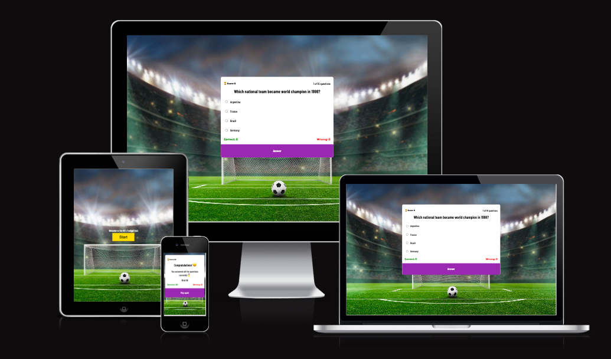
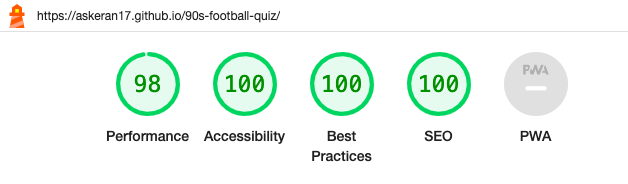

# The 90´s Football Quiz

The quiz is dedicated to football fans of the 90s. In the last era of the century there were many glorious events, many football stars, there was a different football atmosphere than today, and therefore I would like football fans to refresh their memory and go back a little to the past and feel the emotions that filled them when they watched football in the 90s. This quiz will help them plunge into that atmosphere.

You can check out the website [here](https://askeran17.github.io/90s-football-quiz/)!

## Adaptability on a variety of screen sizes

## Design
I used program "Balsamiq Wireframes" to draw a page layout.

## Features

### Existing Features

__Start screen__

- At the start screen you see a football field with a ball, as well as a greeting - this all indicates that we will be talking about football. There is also a start button at the start, which will introduce the user to the quiz.

__Game Quiz__

- After the user presses the start button, he is taken to a screen that shows the quiz. There are 10 questions waiting for him, each of which offers 4 possible answers. Here the user also has the opportunity to track how many correct answers he guessed and how many incorrect ones. If the option is correct, then it goes into the green column; if it is incorrect, it goes into the red column. The score is also displayed at the top of the quiz itself. If the user guesses the correct answer, he gets 5 points; if not, he receives a message that next time he will be able to guess.

__Footer__

- After answering all questions, the user receives the result and the final message.

## Testing

Throughout the development of the site, I used Google's developer tools to identify and fix any problems along the way.

If something didn't work correctly, I also used Google's developer tools to tweak and fix the problem.

I've thoroughly tested each page using Google Chrome's developer tools to ensure each page is responsive on a variety of screen sizes and devices.

### Lighthouse

I used Lighthouse within the Chrome Developer Tools to test the performance, accessibility, best practices and SEO of the website.

### Desktop Results

The quiz showed good scores.

### Mobile Results

The quiz showed good scores.

### Manual Testing

__Visitors__

| Goal | Has the goal been achieved? |
| :--- | :--- |

### Validator Testing 

- HTML
  - No errors were returned when passing through the official [W3C validator](https://validator.w3.org/nu/?doc=https%3A%2F%2Faskeran17.github.io%2F90s-football-quiz%2F)
- CSS
  - No errors were found when passing through the official [(Jigsaw) validator](http://jigsaw.w3.org/css-validator/validator?lang=en&profile=css3svg&uri=https%3A%2F%2Faskeran17.github.io%2F90s-football-quiz%2F&usermedium=all&vextwarning=&warning=1)

- JAVASCRIPT
  - No errors were returned when passing through the official [JSHint validator](https://jshint.com/)

### Unfixed Bugs

I wanted to add an interactive function for entering a name in the start display so that when the final result occurs, the person’s name is saved in a separate list of points scored and the result is recorded under his name. But I still haven’t figured out how to do it, so I don’t have this function.

  ## Technologies Used

### Workspace

I did all the work in Codeanywhere, and at the same time I used VSCode as a draft and sometimes wrote the code there, and then copied it from there and pasted it into Codeanywhere.

### Languages Used

HTML, CSS, Javascript

### Frameworks, Libraries & Programs Used

* [Github](https://github.com/) - To save and store the files for the website.

* [Google Fonts](https://fonts.google.com/) - To import the fonts used on the website.

* [Google Developer Tools](https://developers.google.com/web/tools) - To troubleshoot and test features, solve issues with responsiveness and styling.

* [IloveImg](https://www.iloveimg.com/) To resize images.

* [Convertio](https://convertio.co/) To convert images to webp format.

* [Favicon.io](https://favicon.io/) To create favicon.

* [Balsamiq](https://balsamiq.com/) - Used to create wireframes.

* [Am I Responsive?](http://ami.responsivedesign.is/) To show the website image on a range of devices.

* [Emojipedia](https://emojipedia.org/) Emoji for quiz.

## Deployment

The site was deployed to GitHub - [The 90´s Football Quiz](https://askeran17.github.io/90s-football-quiz/)

The steps to deploy are as follows:

1. Login (or signup) to Github.
2. Go to the repository for this project, [90s-football-quiz](https://github.com/Askeran17/90s-football-quiz.git)
3. Click the settings button.
4. Select pages in the left hand navigation menu.
5. From the source dropdown select main branch and press save.
6. The site has now been deployed.

## Credits 

I was inspired by this video (https://www.youtube.com/watch?v=p-2G-7vLuV4) and this project (http://quizapp.sadiqmagbul.host20.uk)and partially took the code from them.

### Content 

- All content for the site was written by myself.

### Media

- The background image in site I took from open source, i.e. google.
